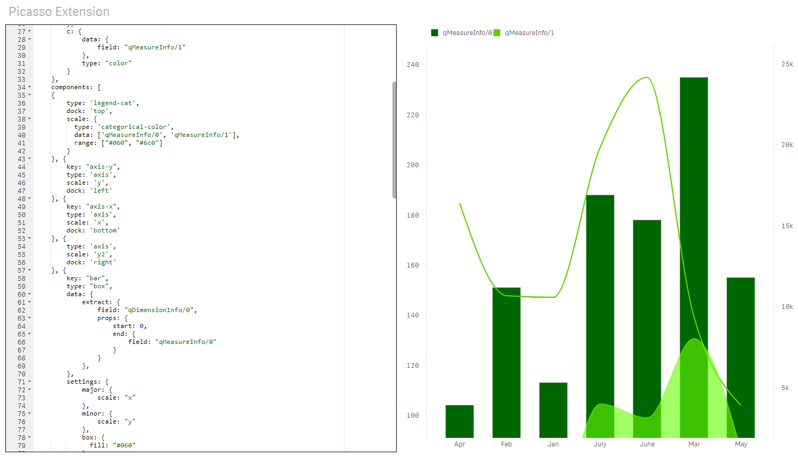

# Picasso Editor Extension
[](https://app.codacy.com/app/konne/q2g-ext-picasso?utm_source=github.com&utm_medium=referral&utm_content=q2g/q2g-ext-picasso&utm_campaign=badger)
[](https://m.sense2go.net/extension-package)

This extension was developed, to ease the development of Picasso.js charts. The big advantage is, that you can see without compiling your code, what your changes in your chart object resolve in. Because of the implementation of a fully working editor, you can directly see syntax errors, as well as errors in the notation of you JSON objects. 
This extension is most useful in connection with the q2g-com-picasso, which is a component for the widget editor of Qlik Sense.


## Intro




## Example of using Qlik Data

```js
var settings = {
	scales: {
		x: {
			data: {
				extract: {
				    field: 'qDimensionInfo/0'
				},
			},
			padding: 0.4
		},
		y: {
			data: {
				field: 'qMeasureInfo/0'
			},
			expand: 0.1,
			invert: true
		}
	},
	components: [
	{
        key: "axis-y",
		type: 'axis',
		scale: 'y',
		dock: 'left'
	}, {
        key: "axis-x",
		type: 'axis',
		scale: 'x',
		dock: 'bottom'
	}, {
	    key: "bar",
	    type: "box",
	    data: {
	        extract: {
	            field: "qDimensionInfo/0",
    	        props: {
    	            start: 0,
    	            end: {
    	                field: "qMeasureInfo/0"
    	            }
    	        }
	        },
	    },
	    settings: {
	        major: {
	            scale: "x"
	        },
	        minor: {
	            scale: "y"
	        },
	        box: {
              fill: "#060"
            }
	    }
	}]
};

let chart = picasso.chart({
	element: element,
	data: data,
	settings: settings
});

```

## Install

### binary

1. [Download the ZIP](https://m.sense2go.net/extension-package) and unzip
2. Qlik Sense Desktop
   Copy it to: %homeptah%\Documents\Qlik\Sense\Extensions and unzip
3. Qlik Sense Entripse
   Import in the QMC


### source

1. Clone the Github Repo into extension directory
2. Install [nodejs](https://nodejs.org/)
3. Open Node.js command prompt
4. npm install
5. npm run build